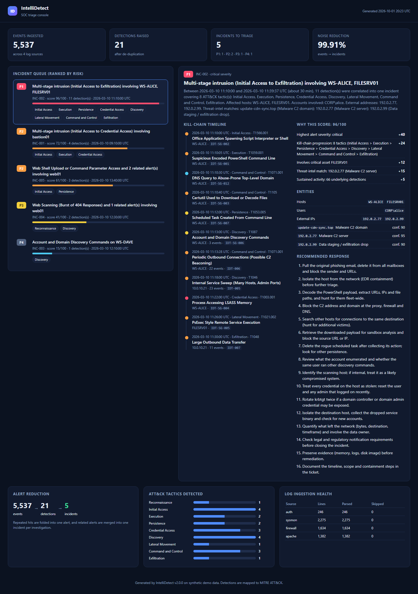
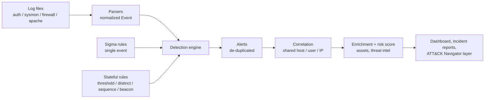

# IntelliDetect

[](https://github.com/chandankumar-sec/intellidetect-siem/actions/workflows/ci.yml)


**A small detection-engineering and alert-triage pipeline for SOC analysts.** It reads Linux auth,
Sysmon, firewall and web-server logs, raises detections from Sigma and stateful rules, folds them
into a short list of incidents, and ranks those incidents with a risk score that explains itself.

The problem it targets is **alert fatigue**: on the bundled demo data, 5,537 log events become
21 detections and then **5 incidents**, ranked P1 to P4, each with a kill-chain timeline and a
recommended response.



## Quick start

```bash
git clone https://github.com/chandankumar-sec/intellidetect-siem
cd intellidetect-siem
pip install -e .

intellidetect demo --serve          # simulate logs, detect, report, then serve the dashboard
# open http://localhost:8000/dashboard.html
```

Only dependency: PyYAML. The demo writes everything to `out/`:

| File | Contents |
|---|---|
| `dashboard.html` | Self-contained triage console (works offline) |
| `reports/INC-*.md` | One incident report per incident ([example](docs/examples/incident-report-multistage.md)) |
| `alerts.json`, `incidents.json`, `summary.json` | Machine-readable results |
| `attack_navigator_layer.json` | Load into [ATT&CK Navigator](https://mitre-attack.github.io/attack-navigator/) |

Docker: `docker build -t intellidetect . && docker run -p 8000:8000 intellidetect`

## How it works



1. **Parse.** Four parsers turn raw lines into one normalized `Event` model with UTC timestamps.
2. **Detect.** 12 portable [Sigma](https://sigmahq.io) rules plus 8 stateful rules, 20 detections in
   total, mapped to MITRE ATT&CK ([catalog](docs/DETECTIONS.md)). Time logic uses *event* time,
   so replaying old logs gives the same answer as live data. Repeated hits fold into one alert.
3. **Correlate.** Alerts sharing a host, user or IP within 30 minutes become one incident. IPs are
   mapped to hostnames through the asset inventory, so a firewall alert about `10.0.10.21` joins
   the Sysmon alerts on `WS-ALICE`.
4. **Score.** 0-100 with every point attributed: highest severity, kill-chain progression, asset
   criticality, threat-intel match, volume. No black box: the dashboard shows *why* an incident is P1.

More detail in [docs/ARCHITECTURE.md](docs/ARCHITECTURE.md).

## Detections

| Tactic | Examples |
|---|---|
| Initial Access | Office app spawning a shell, SQL injection, path traversal, login success after brute force |
| Execution | Encoded PowerShell, `sudo curl \| bash` |
| Persistence | Scheduled task creation, web shell upload and use |
| Credential Access | SSH brute force, password spraying, LSASS memory access |
| Discovery / Reconnaissance | Port scan, internal SMB/RDP/SSH sweep, AD discovery commands, 404 flood |
| Lateral Movement | PsExec-style remote execution |
| Command and Control | Beaconing (regular-interval connections), abuse-prone TLD lookups, certutil download |
| Exfiltration | Large outbound transfer (summed over a window) |

### Example: a Sigma rule and its Splunk SPL

Rules are standard Sigma YAML:

```yaml
title: Office Application Spawning Script Interpreter or Shell
name: IDT-SG-002
tags: [attack.initial_access, attack.t1566.001, attack.t1204.002]
logsource: { category: process_creation, product: windows }
detection:
    selection_parent:
        ParentImage|endswith: ['\winword.exe', '\excel.exe', '\powerpnt.exe', '\outlook.exe']
    selection_child:
        Image|endswith: ['\cmd.exe', '\powershell.exe', '\wscript.exe', '\mshta.exe']
    condition: selection_parent and selection_child
level: high
```

`intellidetect sigma-to-spl --rule <file>` prints an approximate Splunk search for analyst review:

```text
index=main sourcetype="XmlWinEventLog:Microsoft-Windows-Sysmon/Operational" EventCode=1
| where ((like(lower(ParentImage), "%\\winword.exe") OR like(lower(ParentImage), "%\\excel.exe") ...)
        AND (like(lower(Image), "%\\cmd.exe") OR like(lower(Image), "%\\powershell.exe") ...))
| table _time, host, user, ParentImage, Image
```

### Example: a stateful rule

```yaml
- id: IDT-003
  title: Successful Login After Brute Force
  severity: critical
  tactic: Initial Access
  technique: T1078
  type: sequence
  match: { kind: auth_success }
  preceded_by:
    match: { kind: auth_failure }
    count: 5
  group_by: src_ip
  window: 600
```

## Results on the demo data

| | |
|---|---|
| Events ingested | 5,537 |
| Detections raised (after de-duplication) | 21 |
| Incidents to triage | **5** (P1: 1, P2: 2, P3: 1, P4: 1) |
| Attack scenarios detected and correlated into one incident | 4 / 4 |
| Benign look-alikes handled correctly (scanner, backup, telemetry, typo, help-desk) | 5 / 5 |

**Read this before quoting the numbers:** the data is synthetic and I wrote both the attack
scenarios and the rules, so this is a regression test and a demonstration of the design, not a
benchmark of real-world accuracy. The method, the tricky benign cases and the limitations are in
[docs/EVALUATION.md](docs/EVALUATION.md). Reproduce with `intellidetect evaluate`.

## Using your own logs

```bash
intellidetect detect --logs /path/to/logs --out out \
    --env my_environment.yml --intel my_iocs.csv
```

Expected file names in the log directory: `auth.log`, `sysmon.log`, `firewall.log`,
`apache_access.log` (formats are documented in [`parsers.py`](src/intellidetect/parsers.py)).
`environment.yml` holds your asset inventory (hostname, IP, criticality) and allow-lists;
copy [`src/intellidetect/data/environment.yml`](src/intellidetect/data/environment.yml) as a template.

## Commands

| Command | Purpose |
|---|---|
| `intellidetect demo [--serve]` | Simulate, detect, report in one step |
| `intellidetect simulate` | Generate labeled sample logs and `ground_truth.json` |
| `intellidetect detect` | Run the pipeline on a log directory |
| `intellidetect evaluate` | Score detections against the ground truth |
| `intellidetect rules` | List the loaded detections |
| `intellidetect sigma-to-spl` | Print Splunk SPL for the Sigma rules |
| `intellidetect serve` | Serve an output directory over HTTP |

## Project layout

```text
src/intellidetect/
  parsers.py      log lines -> Event          engine.py     Sigma + stateful detections
  sigma.py        Sigma loader and SPL export correlate.py  alerts -> incidents
  matching.py     field modifiers             scoring.py    explainable risk score
  simulator.py    labeled attack scenarios    reporting.py  incident reports, ATT&CK layer
  rules/          Sigma + native YAML rules   dashboard.py  standalone HTML console
tests/            103 tests, 97% coverage     docs/         architecture, catalog, playbooks
archive/          the original v1 prototype, kept for history
```

## Development

```bash
pip install -e ".[dev]"
pytest --cov=src/intellidetect      # 103 tests
ruff check .
python scripts/make_docs.py         # regenerate docs/DETECTIONS.md and docs/EVALUATION.md
```

CI runs lint and tests on Python 3.10, 3.11 and 3.12.

## Triage playbooks

Short analyst playbooks for the scenarios the pipeline detects: [docs/playbooks](docs/playbooks).

## Limitations and roadmap

- Fixed log formats; no Windows Event Log (EVTX) or JSON ingestion yet.
- Correlation is entity-and-time based; it does not follow process trees.
- Sigma support is a documented subset (no `count()` aggregations or field-mapping pipelines).
- The bundled threat-intel feed is synthetic. Live lookups (VirusTotal, AbuseIPDB) are not implemented.
- Next: EVTX and JSON ingestion, a Sigma-to-Elastic backend, and analyst feedback to tune rules.

## License

MIT. See [LICENSE](LICENSE). Built by [Chandan Kumar](https://www.linkedin.com/in/chandan-kumar-2b14b7214),
cybersecurity student at COMSATS University Islamabad. All IP addresses in the simulator use the
RFC 5737 documentation ranges.
